## LAB-01: Exploring an Existing Report with Microsoft Fabric Copilot

### Overview

Use Microsoft Fabric Copilot to understand and analyze an existing report using natural language interactions. Learn how to ask Copilot questions, generate summaries, and explore visualizations effectively.

1. In the **<inject key= "WorkspaceName" enableCopy="false"/>** workspace click on the **sample-report** to open it.

    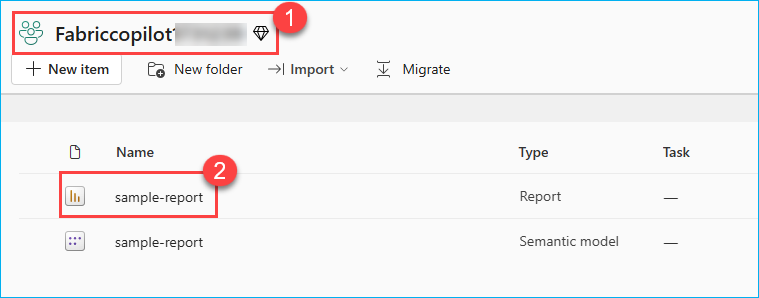

2. Explore the sample Fabrikam Company Sales Report.

    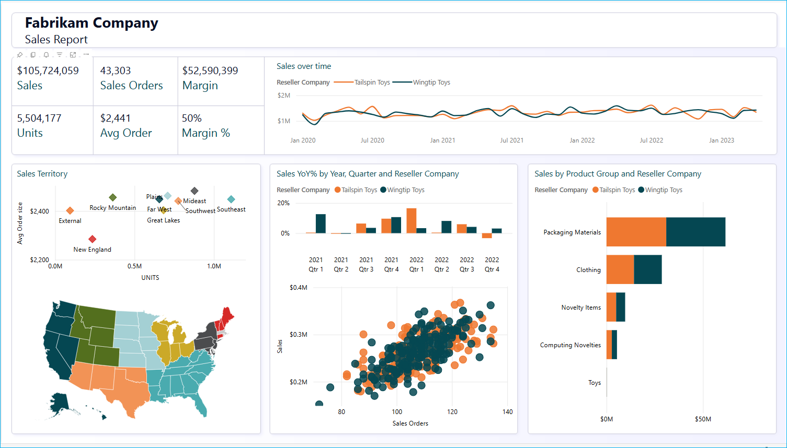

3. Click on the **Copilot** button on the Copilot popup click on **Get Started**.

    >**Note**: Please ensure that the **Preview** toggle button is turned off for now.

    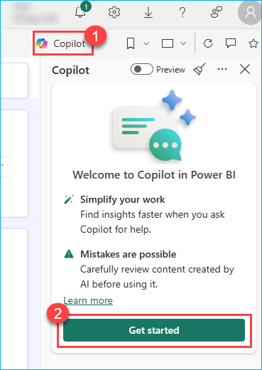

4. Lets Summrize the report using the copilot. Click on the option **Give me an executive summary**. 

    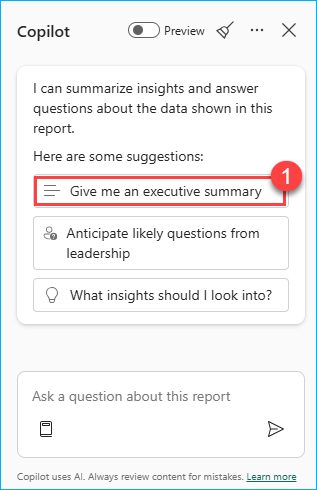

5. Understand the **executive summary** output provided by Copilot.

    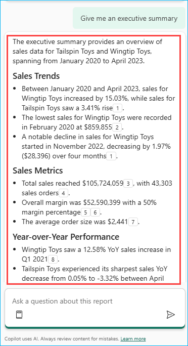    

6. Click on the **Prompt guide** button and click on the option **Summarize visuals on the page**.

    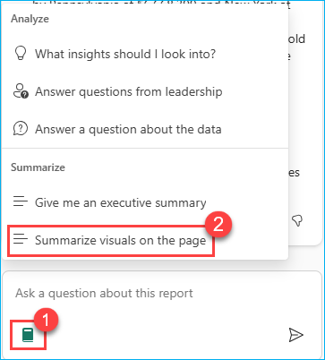

7. Understand the **Summarize visuals on the page** output provided by Copilot.

    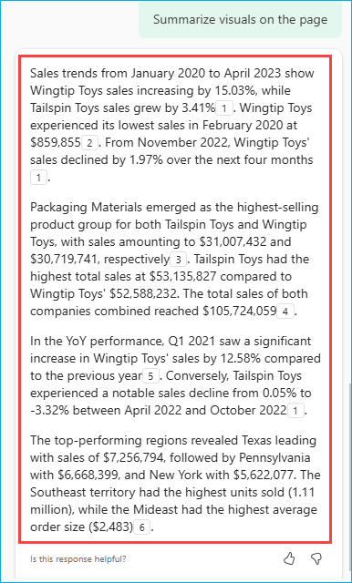

8. Click in the **Copilot chat** field and enter the following prompt and click on **send** button.

    >**Note:** Copilot answers may vary between users and sessions. Results can sometimes be inconsistent.

    ```
    Which product group had the highest sales for each company?
    ```

    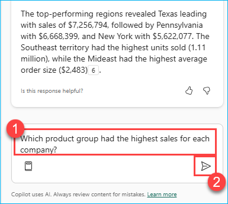

9. For the above prompt will get the output as following:

    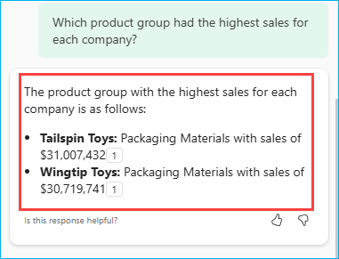

10. Similarly, we can ask Copilot a few questions to better understand the report data, such as:

    - How did Wingtip Toys perform in Q1 2021 compared to the previous year?
    - Who had higher overall sales, Tailspin or Wingtip?
    - List the top three regions by sales.
    - Which territory sold the highest number of units, and how many units were sold?
    - What was Wingtip Toys' lowest sales month?

To gain deeper insights from the report, perform advanced calculations, and generate DAX queries for more detailed comparisons, enable the **Preview** feature by toggling the switch.

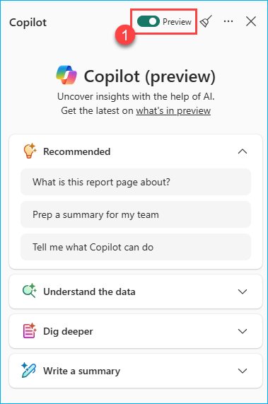

11. Now, let’s request data that requires advanced calculations. Paste the following prompt into the **Copilot chat** field and click the **Send** button.

    ```
    Compare the sales of Packaging Materials between Wingtip Toys and Tailspin Toys, and present the difference as a percentage.
    ```
    >**Note**: If the above prompt doesn't return the expected result, try the alternative below. Copilot responses may vary by session. The next prompt is more precise and requests the DAX query with an explanation.

    ```
    Compare the sales of Packaging Materials between Wingtip Toys and Tailspin Toys.Show the result in a table format with three columns:
    Wingtip Toys Sales, Tailspin Toys Sales, and Difference (%).
    Also include a short summary explaining the difference and how the percentage was calculated. Provide the DAX used to reach the result.
    ```

    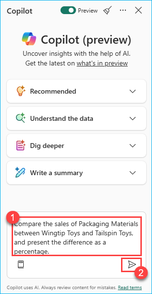

12. Now, let’s closely examine the results provided by Copilot along with a brief description of the insights generated.

    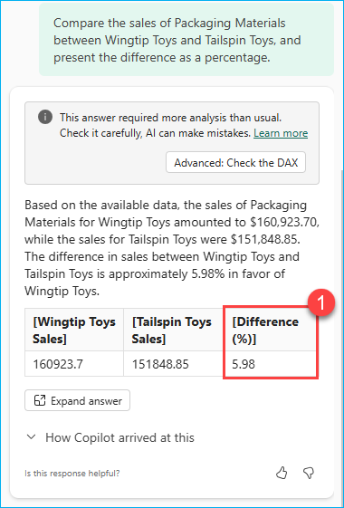


Let’s explore the results provided by Copilot, which include an approximate percentage difference, an Advanced section labeled **Check the DAX**, and a description explaining **How Copilot arrived at this.**

13. Click on the **Advance: Check the DAX** to understand see the **DAX query** Copilot has written to provide the difference as percentage and click on the **x** icon to close the window.

    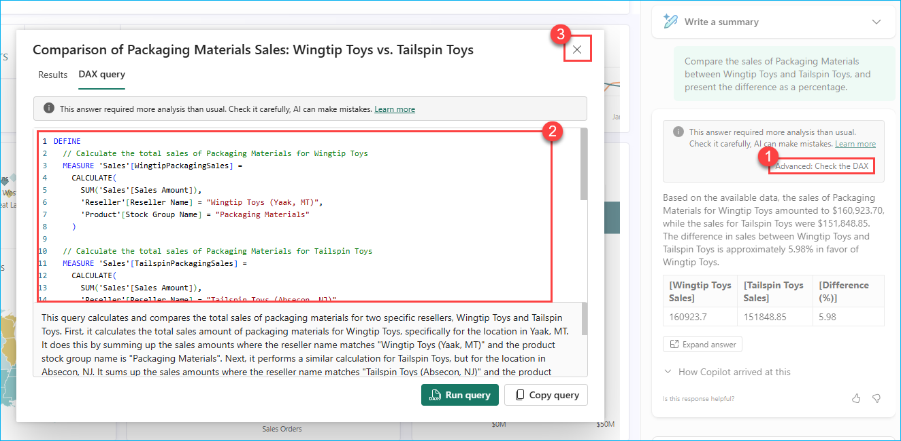

14. Clicking on the **How Copilot arrived at this** drop-down provides a detailed explanation of how Copilot reached its conclusion, helping you better understand the underlying logic and analysis. 

    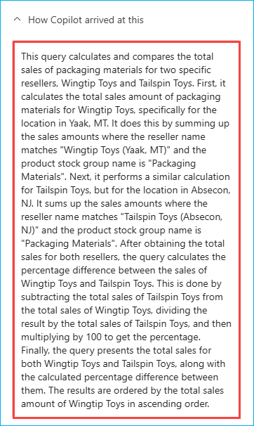

15. Similarly, we can ask Copilot a few questions to better understand the report data in a advance level, such as:

    - Create a list of Territory ranked by percentage of total sales
    - Calculate the year-over-year growth in sales for Wingtip Toys between 2021 and 2022
    - Compare the monthly average order size between Southeast and Mideast territories.
    - Identify months where Wingtip Toys' sales dropped more than 5% compared to the previous month.
    - Provide the percentage of total sales contributed by each product group. Based on this, suggest which products we should consider scaling up or phasing out.

16. Now, let’s explore potential leadership-level insights using Copilot. Click on the **Copilot chat** field, enter the following prompt, and then click the **Send** button.
    
    ```
    Give a concise summary of this report and then provide a bulleted list of questions that leadership could ask about it.
    ```
    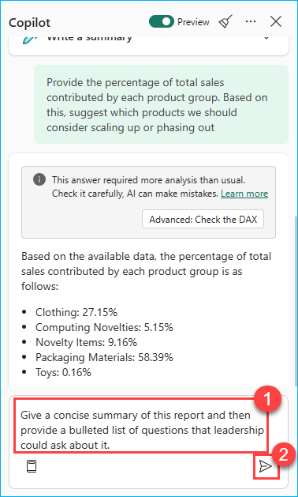

17. Now, let’s closely examine the results provided by Copilot.

    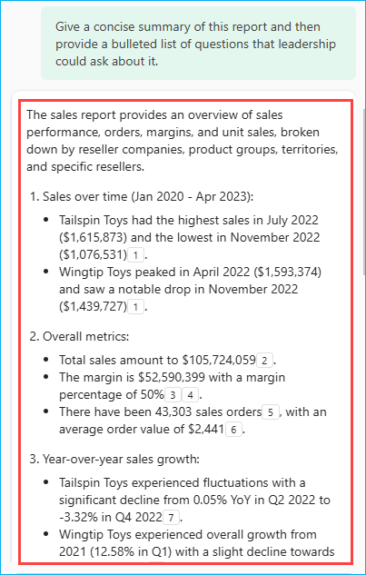

    >**Note:** Copilot responses may vary across users and sessions due to differences in context, report data, and how prompts are phrased. While Copilot aims to provide accurate insights, responses can occasionally be inconsistent.

In this Lab, we explored how to use Microsoft Fabric Copilot to analyze and understand an existing report. We enabled the Copilot Preview feature, interacted with the Copilot chat to generate insights, performed advanced data analysis using DAX-based prompts, and examined the results including sales trends, product performance, regional contributions, and inventory analysis. This helped us simulate how leadership and business users can ask natural language questions to gain actionable insights from Power BI reports using Fabric Copilot.

Now, click on Next from the lower right corner to move on to the next page.

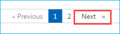