## LAB-02: Create a Report using Semantic Model and generate insights using Copilot for Power BI

### Overview

Create a report using a semantic model in Power BI and leverage Copilot to automatically generate data insights. This approach combines structured data modeling with AI-powered analysis to accelerate report creation and enhance decision-making.

1. Click on **Workspaces** in the side bar and select **<inject key= "WorkspaceName" enableCopy="false"/>**.

    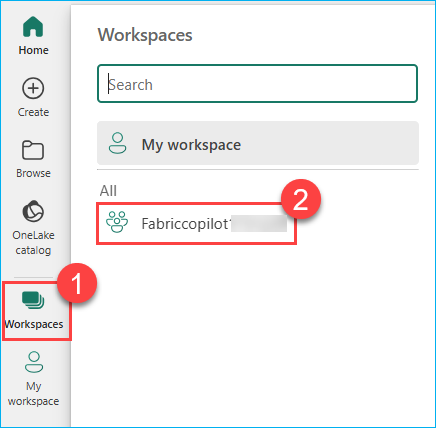

2. To create a new report using this semantic model, Click on **sample-report**.

    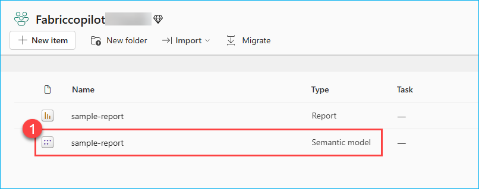

3. Click on the **Explore this data** drop down and click on the **Create a blank report**.

    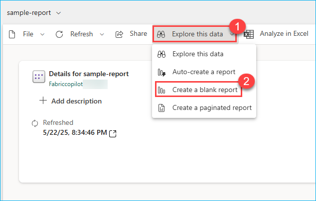

4. Collapse the other panes named Filters, Visualizations and Data and click on the **Copilot** icon.

    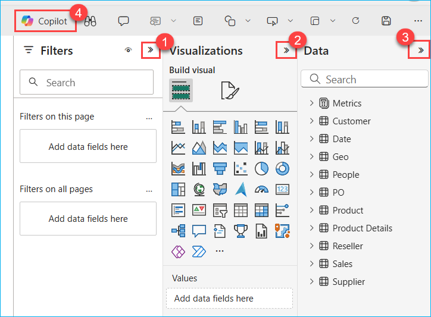

5. Click on **Preview** button to the right side to enable it and click on Get started.

    

You will now see how easy it is for the data analyst to create compelling Power BI reports and get deep insights with literally no hands-on coding!

6. Click on the **Prompt Guide** button and select the option **What's in my data?**.

    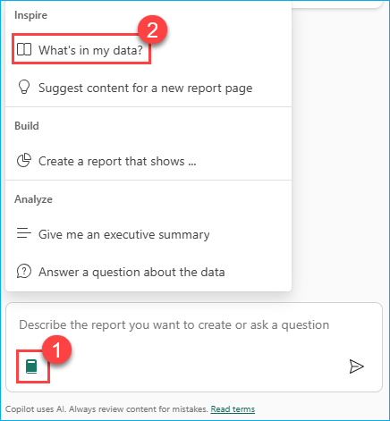

The first option, 'What’s in my data?' provides an overview of the contents of the dataset, identifies and describes what’s in it and what the attributes are about. So, there’s no need to wait for someone to explain the dataset. This improves the efficiency and volume of report creation.

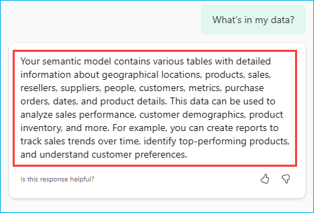

7. Click in the **Copilot chat** box field and enter the **prompt** below and click on the **Send** button.

    ```
    Create a visually engaging sales performance report using vibrant colors. Include insights on top-performing products, regional sales trends, and customer demographics using data from geographical locations, products, and customers tables
    ```

    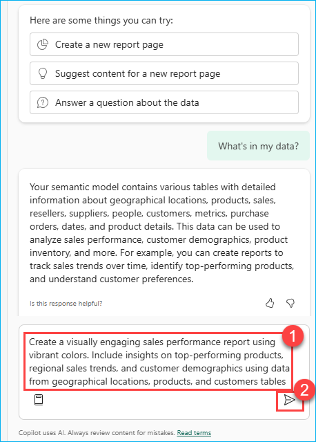

    >**Note:** If you see the error message saying, 'Something went wrong.', try refreshing the page and restart the task. Being in a shared environment, the service may be busy at times.
    > - If Copilot needs additional context to understand your query, consider rephrasing the prompt to include more details.

    >**Note:** The responses from Copilot may not match the ones in the screenshot but will provide a similar response.

    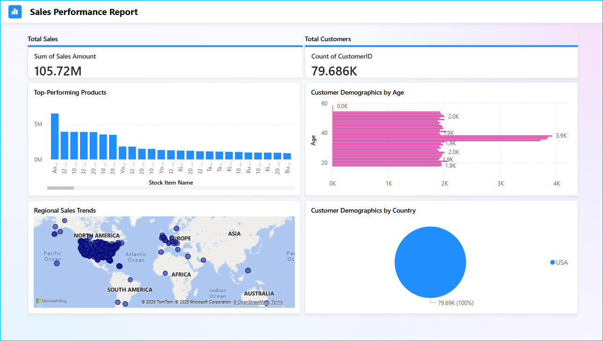

    Based on the customer demographics in the report, the majority of our customers fall between the ages of 35 and 40. Let's ask Copilot if it has any recommendations for improving the Sales within this dminant age group.
    
    We’ll ask Copilot for suggestions based on the results and data in the report.

8. Enter the below prompt in **Copilot chat** field, and press the **Send** button.

    ```
    Can you suggest targeted strategies or product recommendations that could further boost engagement and sales within this dominant age group?
    ```
    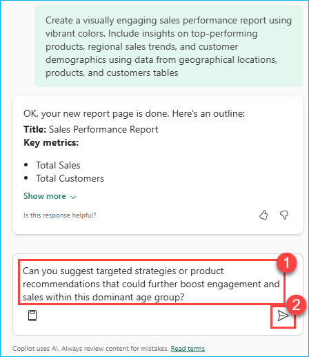

9. Look at the suggestions Copilot provided. Copilot creates the desired Power BI report and even goes a step further to give powerful insights.

    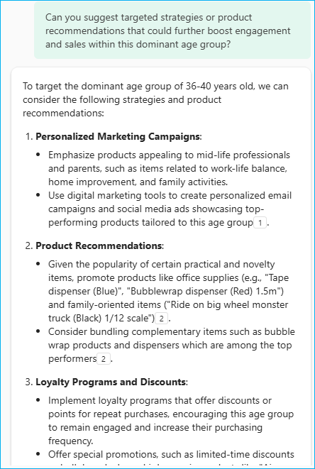

10. Expand the **Visualizations** pane and select the **Narratives** visual.

    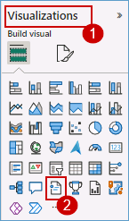

11. Adjust and expand the **narrative box** from the corner to get a better readable view of the result and Click on **Copilot (preview)** button within the visual.

    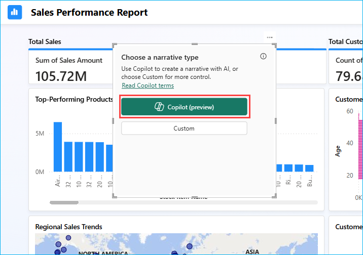

12. Click on **Give an executive summary**.
13. Click on **Update** and observe the generated summary. See how easy it was to get an executive summary with absolutely no IT resource dependency!

    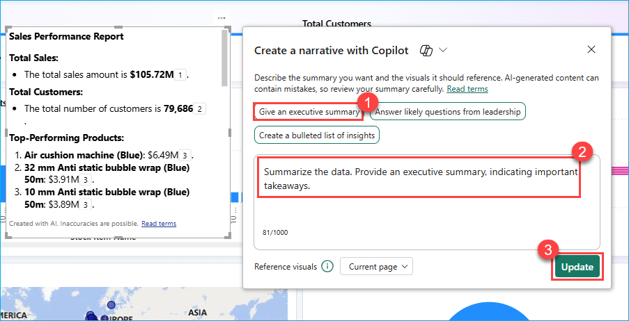

14. Observe the **Narative Summary** is updated with new Summary, and Click on the Close button in the pop-up window.

    >**Note**: If a **Refresh** button appears in the summary, click it to view the updated summary changes.

    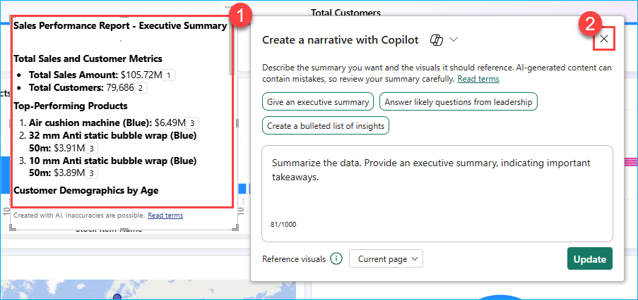

See how easy it was to get an executive summary with absolutely no IT resource dependency!

The summary could also be generated in another language if specified. Additionally, the summary updates if you filter the report on any visual.

We have explored the capabilities of Microsoft Fabric Copilot in enhancing data analysis and report generation. Using an existing sales sample-report, participants learned how to interact with Copilot to generate insights, analyze customer demographics, and uncover actionable business trends through natural language prompts and DAX-powered queries.