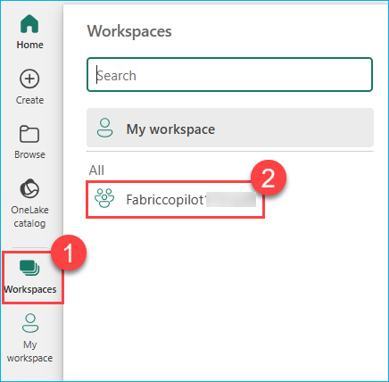

## Microsoft Fabric Copilot Experience for Report Building

### Overview
Copilot and other generative AI features in preview bring new ways to transform and analyze data, generate insights, and create visualizations and reports in Microsoft Fabric and Power BI. This article introduces you to Microsoft Fabric Copilot for Reports and explains how it helps users create and refine reports using natural language. It also highlights key considerations such as data sensitivity, responsible AI usage during report generation and chart modification, and helping users better interpret report insights.

Copilot in Microsoft Fabric is a generative AI assistive technology that aims to enhance the data analytics experience in the Fabric platform for users. Copilot leverages large-language models (LLMs) that attempt to facilitate user interaction with their data and items in Fabric. People who use Copilot can include people who create, manage, and consume Fabric items, including enterprise developers, self-service users, and business users.

### Copilot in Fabric in the Power BI workload

Power BI has introduced generative AI that allows you to create reports automatically by selecting the article for a report or by prompting Copilot for Power BI on a particular article. You can use Copilot for Power BI to generate a summary for the report page that you just created, and generate synonyms for better Q&A capabilities. 

In Power BI, Copilot helps you use the transformational power of generative AI to get the most from your data. We have chat-based experiences where Copilot can help you with tasks from on-the-fly analysis for business users to data analysis expression (DAX) generation for advanced creators. We also have various AI-infused Copilot features throughout the product.

To begin exploring Microsoft Fabric Copilot for Reports, this task focuses on understanding and analyzing a sample report using natural language prompts. Copilot allows users to interact with the report by asking questions, generating summaries, and identifying trends or outliers without needing deep technical skills. This hands-on activity will help you experience how Copilot simplifies report exploration, guides interpretation of visuals, and enhances overall data comprehension through conversational AI.

### Getting Started with the Lab

Welcome to your Microsoft Fabric Copilot Experience for Report Building! We've prepared a seamless environment for you to explore and learn about Microsoft Fabric Copilot. Let's begin by making the most of this experience:

### Accessing Your Lab Environment
 
Once you're ready to dive in, your virtual machine and lab guide will be right at your fingertips within your web browser.
 
.png)

### Virtual Machine & Lab Guide
 
Your virtual machine is your workhorse throughout the workshop. The lab guide is your roadmap to success.
 
### Exploring Your Lab Resources
 
To get a better understanding of your lab resources and credentials, navigate to the **Environment** tab.
 
.png)

### Utilizing the Split Window Feature

For convenience, you can open the lab guide in a separate window by selecting the **Split Window** button from the Top right corner.

### Managing Your Virtual Machine

Feel free to start, stop, or restart your virtual machine as needed from the Resources tab. Your experience is in your hands!

### Lab Guide Zoom In/Zoom Out

To adjust the zoom level for the environment page, click the **A↕ : 100%** icon located next to the timer in the lab environment.

### Let's Get Started with Power BI Portal
 
1. On your virtual machine, click on the **Power BI Portal** icon as shown below:
 
   .png)

2. On the **Enter your email, we'll check if you need to create a new account** tab you will see the login screen, in that enter the following email/username, and click on **Submit**.
 
   - **Email/Username:** <inject key="AzureAdUserEmail"></inject>
 
     .png)
 
3. Now enter the following password and click on **Sign in**.
 
   - **Password:** <inject key="AzureAdUserPassword"></inject>
 
     .png)
     
1. If you see the pop-up **Stay Signed in?**, select **No**.

   .png)

1. You should be able to view the Power BI Portal.

   .png)

### Setting up the Microsoft Fabric Capacity in the workspace.

Setting up Microsoft Fabric Capacity is essential to enable Copilot features in your workspace, allowing you to use AI-powered capabilities like natural language report creation and data exploration. Without Fabric Capacity, Copilot and other advanced Fabric workloads remain unavailable.

1. Click on the **Worksapces** in the left side task bar followed by click on the **<inject key= "WorkspaceName" enableCopy="false"/>**.

    

    >**Note:** If the Introduction task flows (preview) popup appears click on **Got it** button.

    

    >**Note:** On the popup **All the paid features of Power BI are yours for 60 days** click on **Got it** button.

    

2. Click on the **Workspace Settings**. 

    

3. In the **Workspace settings** page click on the **License info** and click on **Edit** to change the License Configuration to Fabric Capacity.

    

4. In the license info page scroll down to **Fabric capacity** and click on the **Radio Button** to select. Under the **License Capacity** select the **<inject key= "fabriccapacity" enableCopy="false"/>** and click on the **Select license** button.

    

Here now we have successfully selected the Fabric Capacity for the workspace. Now lets explore Copilot features!

### Support Contact
 
The CloudLabs support team is available 24/7, 365 days a year, via email and live chat to ensure seamless assistance at any time. We offer dedicated support channels tailored specifically for both learners and instructors, ensuring that all your needs are promptly and efficiently addressed.

Learner Support Contacts:
- Email Support: cloudlabs-support@spektrasystems.com
- Live Chat Support: https://cloudlabs.ai/labs-support

Now, click on **Next** from the lower right corner to move on to the next page.
 
 

### Happy Learning!!
